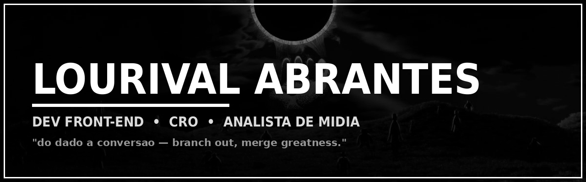

<!--
==================================================================
  README DE PERFIL — Lourival "Junior" Abrantes (@Junior-Abrantes)
  Estilo: minimalista dark, preto & branco (inspirado no "Synax!")
  ⚠️  IMPORTANTE: suba a pasta /assets junto (banner.png, brain.png,
      eclipse-bw.png) — o README aponta pra ela por caminho relativo.
==================================================================
-->

<!-- ===================== BANNER ===================== -->

  

<!-- texto digitando (branco, discreto) -->

 

<!-- pills preto & branco -->

 

<!-- ===================== SOBRE MIM ===================== -->
<h2 align="center">◆ &nbsp; SOBRE MIM &nbsp; ◆</h2>

<table>
<tr>
<td width="34%" align="center">
  
</td>
<td width="66%" valign="middle">

**E aí! Eu sou o Junior 👋**

Analista de Mídia e **dev front-end** movido a café e obcecado por **taxa de conversão**. De dia interpreto dados (CTR, CPC, CPA, ROAS) e planejo campanhas; de noite escrevo componentes que fazem e-commerce vender mais.

Estudante de **Engenharia de Software**, atuo na **IDK Brasil** desenvolvendo componentes de CRO para grandes lojas. Antes disso, escalei **2 perfis do zero a 1 milhão de seguidores** — então eu sei o que faz o número subir.

> *Não é opinião, é o teste que decide.*

</td>
</tr>
</table>

 

<!-- ===================== PROJETOS ===================== -->
<h2 align="center">◆ &nbsp; TOP PROJETOS &nbsp; ◆</h2>

<table>
<tr>
<td width="70%" valign="top">

**`🍽 CATTLEYA FOOD`** &nbsp;→&nbsp; Plataforma web de pedidos pra restaurante premium. UX + automação orientada à conversão.
`TypeScript` · `Apps Script` · `Vercel` — [🔗 ao vivo](https://cattleya-food.vercel.app)

 

**`🩺 CONSULTORIA LUANA`** &nbsp;→&nbsp; Site institucional pra consultoria de medicina. Captação de leads e presença digital.
`TypeScript` · `CSS3` · `Vercel` — [🔗 ao vivo](https://consultoria-luana.vercel.app)

 

**`🛒 CRO COMPONENTS · IDK/CELL`** &nbsp;→&nbsp; Barra de frete grátis, progressão de carrinho, page-takeover e mais — injetados via GCD/CELL em e-commerces.
`JS (ES5/IIFE)` · `GA4 dataLayer` · `GTM` · `Nuvemshop` · `Shopify`

</td>
<td width="30%" align="center" valign="middle">
  
</td>
</tr>
</table>

 

<!-- ===================== STACK ===================== -->
<h2 align="center">◆ &nbsp; STACK &nbsp; ◆</h2>

 

 

<!-- ===================== CONECTE-SE ===================== -->
<h2 align="center">◆ &nbsp; CONECTE-SE &nbsp; ◆</h2>

 

<blockquote>
<i>Código nunca fica pronto — só fica um pouco menos terrível com o tempo.</i>
</blockquote>

<blockquote>
<i>Cada commit é um pequeno acordo com o meu eu do futuro. Um dia volto nesse código, olho o que escrevi e agradeço (ou não).</i>
</blockquote>

 

<!-- ===================== CONTRIBUIÇÕES ===================== -->
<h2 align="center">◆ &nbsp; CONTRIBUIÇÕES &nbsp; ◆</h2>

  

 

◆ &nbsp; <b>Branch out. Merge greatness.</b> &nbsp; ◆

